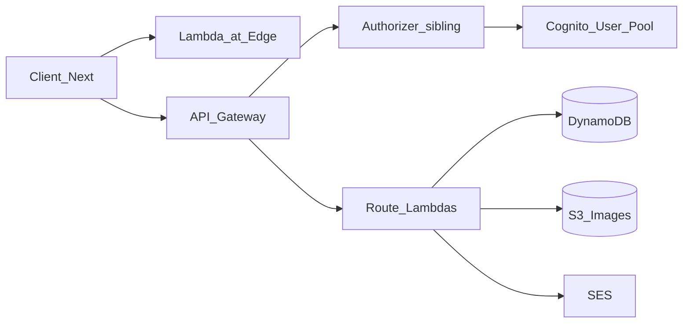

# ARCHITECTURE.md

> Precedence: `CONTEXT.md` > `GOVERNANCE.md` > this file > domain docs.

---

## System shape



- **This repo** owns route Lambdas, shared `src/common/`, OpenAPI `api.yaml`, and most CloudFormation stacks.
- **Authorizer** is a sibling Lambda (TOKEN authorizer ARN imported into the API Gateway stack).
- **Cognito** pool/app client live in this repo’s CFN and issue tokens the authorizer validates.
- **Client** and **Lambda@Edge** are separate repositories.

---

## Folder responsibilities

| Path | Responsibility |
| ---- | -------------- |
| `src/routes/<name>/` | One Lambda: handler, webpack, jest (local), `package.json`, lockfile, `template.yaml` |
| `src/common/` | Shared config, errors, Dynamo/S3/SES/headers/logger |
| `src/types/` | Shared TypeScript types |
| `scripts/` | Multi-package install/build/package/lint/test; seed/reset; cognito token; bastion; preflight |
| `templates/` | Scaffold for `create:route` — keep deps aligned with routes |
| `cloudformation/` | Shared infra (gateway, methods, models, dynamo, cognito, SES, roles, bastion, …) |
| `api.yaml` | OpenAPI 3 contract |
| `.github/workflows/` | Lint/test, merge deploy, manual deploy/rollback, API Gateway deploy |

---

## Dependency direction

```
routes/<name>/index.ts  →  src/common/*  →  src/types/*
```

- Routes may import shared common and types.
- Common must not import route packages.
- Avoid circular imports across common modules.

---

## Packaging

1. Webpack builds each route to `src/routes/<name>/dist/index.js` (`libraryTarget: commonjs2`, `target: node`).
2. Post-build may install production deps into `dist/` (see route `prebuild` / `scripts/post-build.js`).
3. `npm run package` zips `dist/` contents to `dist/<name>.zip`.
4. CI uploads the zip to the Lambda artifact S3 bucket and applies the route `template.yaml` via CloudFormation change set.
5. `Handler` in templates is **`index.handler`**, matching webpack zip contents (`index.js` at the zip root). Do not change Handler or packaging independently without verifying the pair.

Runtime: **`nodejs20.x`** on all route templates; CI uses Node 20.

---

## CloudFormation split

- **Shared stacks** under `cloudformation/` (API Gateway, methods, models, DynamoDB, Cognito, SES, IAM roles, bastion, Lambda S3 artifacts, GitHub OIDC/role, CloudWatch role).
- **Per-route stacks** from each `src/routes/<name>/template.yaml` (`one-hundred-letters-route-<name>-stack-<env>` pattern in workflows).

Deploy order and imports matter — see `docs/INFRA.md` and `docs/CI_CD.md`.

---

## Auth model (runtime)

- API Gateway authorizer: **`Type: TOKEN`**, `IdentitySource: Authorization` header, URI → imported authorizer function ARN.
- Protected methods: `AuthorizationType: CUSTOM`.
- Public: OPTIONS (CORS) and `SendContactEmail` POST (`NONE`), plus reCAPTCHA checks in the contact Lambda as configured.
- OpenAPI may still label schemes as Cognito user pools — **CFN is source of truth for what is deployed**.

---

## Fail signals

- Business logic duplicated instead of shared via `src/common/`
- New HTTP framework or single mega-package without approval
- Secrets or absolute AWS account specifics hardcoded in handlers
- Circular imports between common and routes
- Packaging changes that break CFN Handler resolution
- Editing sibling repos “in place” from this workspace without an explicit request
